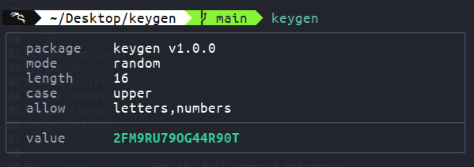

<p align="center">
  
</p>

Keygen is a small Bash utility for generating application secrets, API keys, memorable passwords, UUIDs, and common framework secret formats from the command line.

It uses `/dev/urandom` for built-in character generation and delegates the framework-style shortcuts to `openssl rand` so their output matches the standard commands administrators already use.

### Features

- Random tokens from configurable character sets
- Memorable passphrases backed by a local, installed, cached, or remote wordlist
- UUID v4 generation
- Hex, base64, base64url, base32, base58, and nanoid-style tokens
- One-shot shortcuts for JWT secrets, app keys, Django secrets, and URL-safe secrets
- Version checks, self-update, and system install commands

<p align="center">
  
</p>

> [!NOTE]
> Installation is optional, but recommended for persistent aliases and global access.

<!-- Installation -->
<details>
  <summary><b>Installation</b></summary>

From the repository root:

```sh
./keygen.sh --install
```

The installer prompts before writing files. When run as root, it installs system-wide; when run as a normal user, it installs under your home directory.

System install:

- Binary: `/usr/bin/keygen`
- Shared data: `/usr/share/keygen`
- Default config: `/usr/share/keygen/default.conf`
- User config: `/usr/share/keygen/config/keygen.conf`
- Wordlists: `/usr/share/keygen/wordlist`

User install:

- Binary: `~/.local/bin/keygen`
- Shared data: `~/.local/share/keygen`
- Default config: `~/.local/share/keygen/default.conf`
- User config: `~/.local/share/keygen/config/keygen.conf`
- Wordlists: `~/.local/share/keygen/wordlist`

Use `PREFIX` to install somewhere else:

```sh
PREFIX="$HOME/.local" ./keygen.sh --install
```

The installer checks common system and user locations before installing so you do not accidentally keep both a system and local copy. It creates the user config and bundled wordlist only when they do not already exist, so local settings and custom wordlists are preserved across updates.

**Updates and version checks:**

```sh
keygen --version # Prints the local version and checks the upstream repository for updates.
keygen --update  # Downloads the latest stable version.
                 # This only updates the script and metadata only; it does not overwrite the installed user config or wordlists.
```

Patch versions are bumped automatically on pushes to main branch that change core runtime files only.
</details>

<!-- Configuration -->
<details>
  <summary><b>Configuration</b></summary>

The installed config file is a shell-style file:

```sh
# ~/.local/share/keygen/config/keygen.conf
plain=false
spinner=true
type=random
length=16
words=3
CASE=default
allow=letters,numbers
separator=hyphen
count=1
MEMO_CAPITALIZE=false

REMOTE_WORDLIST_MIN_LEN=3
REMOTE_WORDLIST_TIMEOUT=5
```

Environment variables still work for one-off overrides:

```sh
REMOTE_WORDLIST_MIN_LEN=5 keygen --type memorable
```

Memorable mode resolves wordlists in this order:

1. `LOCAL_WORDLIST_PATH`, if set
2. Installed wordlist under the selected shared data directory
3. Bundled repository wordlist under `wordlist/en-memorable.txt`
4. Cached wordlist under `${XDG_CACHE_HOME:-$HOME/.cache}/keygen/wordlist.txt`
5. Built-in fallback words

If no usable local wordlist is found, `keygen` attempts to download the project wordlist and cache it.
</details>

<!-- Usage -->
<details>
  <summary><b>Usage</b></summary>

Run `keygen --help` for the full command reference.

```txt
Options:
      --safe              Generate a .env-friendly and URL-safe value using the A-Za-z0-9._~- charset.

  -t, --type VALUE        Output mode.
                          Values: random, memorable, uuid, hex, base32, base58, base64, base64url, nanoid, token, {special types}

  -c, --case VALUE        Letter casing for generated output.
                          Values: default, lower, upper, capitalize
                          Default: default

  -l, --length N          Length for random and key-based formats.
                          Range: 8-64
                          Default: 16

  -w, --words N           Number of words for memorable passwords.
                          Range: 1-10
                          Default: 3

  -s, --separator VALUE   Word separator for memorable mode.
                          Values: hyphen, space, period, comma, underscore, none
                          Default: hyphen

  -a, --allow VALUE       Comma-separated character classes to include.
                          Values: letters,numbers,symbols,hyphen,space,period,comma,underscore,all
                          Default: letters,numbers

  -n, --count N           Number of values to generate.
                          Default: 1

  -v, --version           Print the current version and check for updates.
  -u, --update            Update the installed or local script from GitHub.
  -i, --install           Install keygen. Uses /usr when run as root, otherwise ~/.local.
  -p, --plain             Print generated values only. Disables colors, boxes, and labels.
      --no-spinner        Disable the progress spinner.
  -h, --help              Show this help message.
```

Note: Supported types can be used directly without the --type flag, e.g. keygen jwt.

```
Special types:
  jwt                     Generate a JWT secret.
  secret                  Generate a general-purpose secret.
  general                 Generate a general-purpose secret key for apps, APIs, and services.
  token                   Generate a URL-safe 32-byte Base64 secret without padding.
  django                  Generate a Django-style secret key.
```
```
Environment (memorable mode):
  REMOTE_WORDLIST_URL      Source URL. Default: project wordlist on GitHub
  LOCAL_WORDLIST_PATH     Local cache/fallback. Default: installed/bundled wordlist, then XDG cache
  REMOTE_WORDLIST_MIN_LEN      Minimum word length. Default: 3
  REMOTE_WORDLIST_TIMEOUT  Download timeout (seconds). Default: 5
```
```
Install/update environment:
  PREFIX                     Install prefix. Default: /usr as root, otherwise ~/.local
  KEYGEN_BIN_DIR             Override binary directory.
  KEYGEN_SHARE_DIR           Override shared data directory.
```

</details>

<!-- FAQ -->
<details>
  <summary><b>FAQ</b></summary>

  1. Why `keygen -t hex -l 32` differs from `openssl rand -hex 32`? \
    - `keygen -t hex -l 32 -c lower` generates 32 hex characters. \
    - `openssl rand -hex 32` generates 32 random bytes and prints them as hex. Each byte becomes two hex characters, so the output is 64 hex characters.

  Use `keygen jwt` or `keygen secret` when you want the exact `openssl rand -hex 32` behavior.
</details>

## License

MIT. See [LICENSE](LICENSE).
